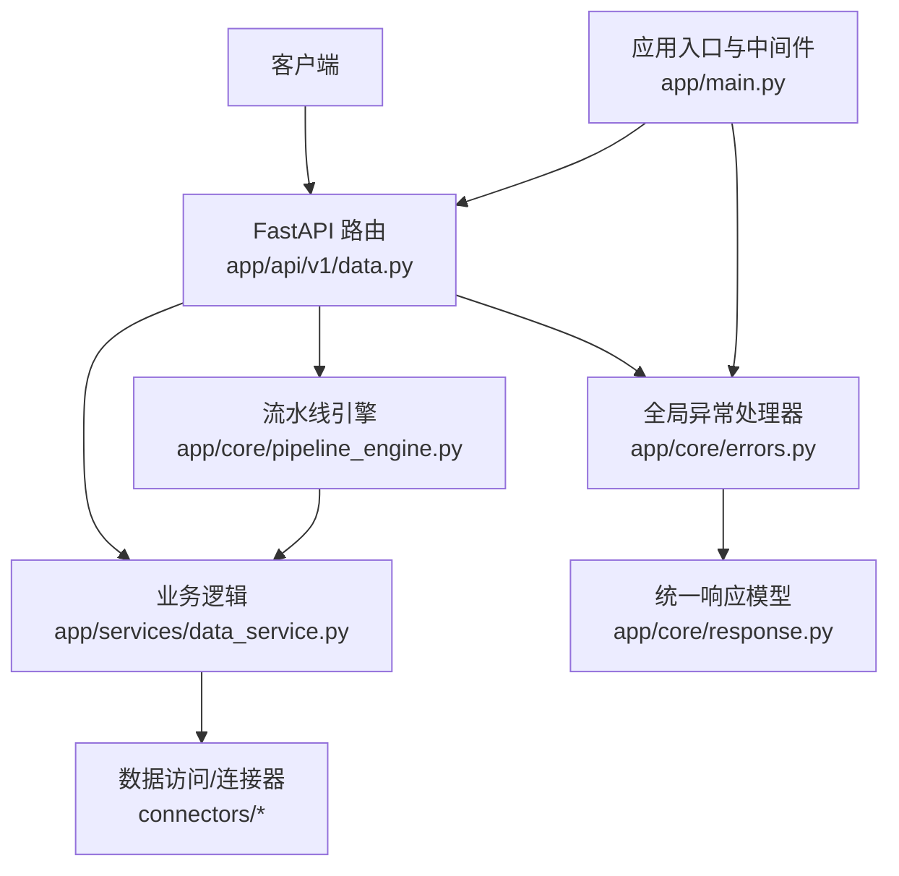
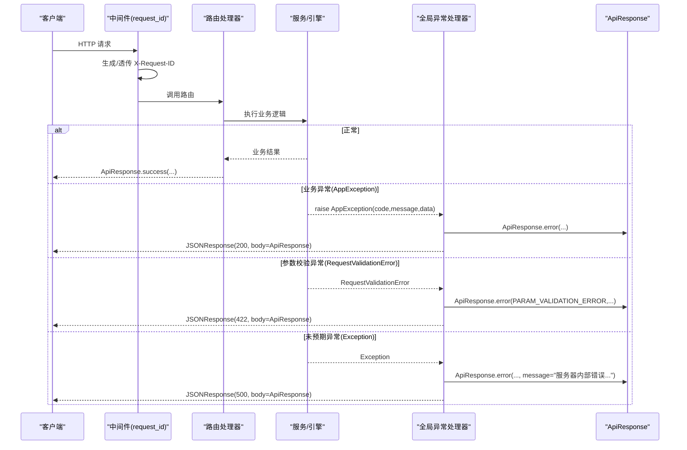
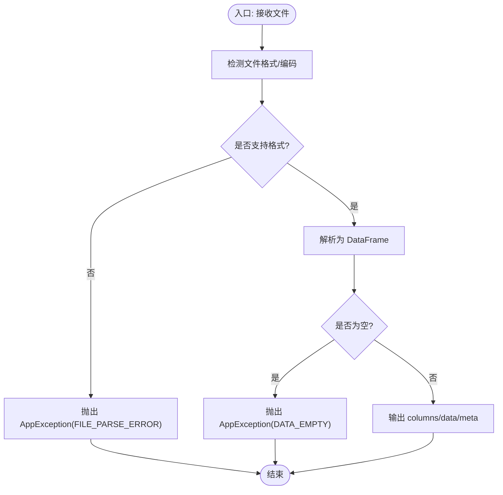
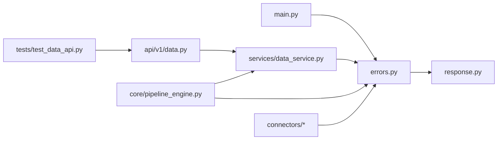

# 错误处理

<cite>
**本文引用的文件**
- [app/core/errors.py](file://app/core/errors.py)
- [app/core/response.py](file://app/core/response.py)
- [app/main.py](file://app/main.py)
- [app/api/v1/data.py](file://app/api/v1/data.py)
- [app/services/data_service.py](file://app/services/data_service.py)
- [app/core/pipeline_engine.py](file://app/core/pipeline_engine.py)
- [app/core/connectors/file_upload.py](file://app/core/connectors/file_upload.py)
- [tests/test_data_api.py](file://tests/test_data_api.py)
</cite>

## 目录
1. [简介](#简介)
2. [项目结构](#项目结构)
3. [核心组件](#核心组件)
4. [架构总览](#架构总览)
5. [详细组件分析](#详细组件分析)
6. [依赖关系分析](#依赖关系分析)
7. [性能考量](#性能考量)
8. [故障排查指南](#故障排查指南)
9. [结论](#结论)
10. [附录：错误码与最佳实践](#附录错误码与最佳实践)

## 简介
本文件系统性梳理项目的错误处理机制，覆盖自定义异常类型与层次、统一响应格式与错误码规范、全局异常处理器工作机制与日志策略，以及常见错误的诊断与解决方法。目标是帮助开发者快速定位问题、统一对外错误语义，并提升可观测性与可维护性。

## 项目结构
错误处理相关代码集中在以下位置：
- 统一响应与错误码定义：app/core/response.py
- 自定义异常与全局异常处理器：app/core/errors.py
- FastAPI 应用注册与中间件（request_id 注入）：app/main.py
- 业务层抛出异常与返回统一响应：app/api/v1/data.py、app/services/data_service.py、app/core/pipeline_engine.py、app/core/connectors/file_upload.py
- 测试用例验证错误码行为：tests/test_data_api.py

图表来源
- [app/main.py:46-79](file://app/main.py#L46-L79)
- [app/core/errors.py:15-73](file://app/core/errors.py#L15-L73)
- [app/core/response.py:12-102](file://app/core/response.py#L12-L102)
- [app/api/v1/data.py:39-201](file://app/api/v1/data.py#L39-L201)
- [app/services/data_service.py:77-158](file://app/services/data_service.py#L77-L158)
- [app/core/pipeline_engine.py:249-357](file://app/core/pipeline_engine.py#L249-L357)

章节来源
- [app/main.py:46-79](file://app/main.py#L46-L79)
- [app/core/errors.py:15-73](file://app/core/errors.py#L15-L73)
- [app/core/response.py:12-102](file://app/core/response.py#L12-L102)

## 核心组件
- 统一响应体与错误码：通过枚举集中管理错误码，并提供成功/失败构造方法，确保所有接口返回一致的 JSON 结构。
- 自定义异常 AppException：携带 code、message、data，用于在业务层表达明确的错误语义。
- 全局异常处理器：分别处理业务异常、参数校验异常和未预期异常，统一封装为 ApiResponse，并附带 request_id 便于追踪。
- 请求级上下文：通过中间件注入 request_id，贯穿整个请求生命周期，便于日志关联与链路追踪。

章节来源
- [app/core/response.py:12-102](file://app/core/response.py#L12-L102)
- [app/core/errors.py:15-73](file://app/core/errors.py#L15-L73)
- [app/main.py:64-76](file://app/main.py#L64-L76)

## 架构总览
下图展示一次请求从进入 FastAPI 到被异常处理器捕获并返回统一响应的完整流程。

图表来源
- [app/main.py:64-76](file://app/main.py#L64-L76)
- [app/core/errors.py:30-73](file://app/core/errors.py#L30-L73)
- [app/core/response.py:71-102](file://app/core/response.py#L71-L102)

## 详细组件分析

### 自定义异常与层次结构
- 基础异常类 AppException：承载 code、message、data，默认使用参数校验错误码，便于在业务层显式抛出。
- 当前实现采用“扁平化”的异常类型，通过 ErrorCode 区分不同领域错误；如需扩展，可在 AppException 之上派生更细粒度的异常子类（如业务异常、系统异常），并在全局处理器中按类型分支处理。

章节来源
- [app/core/errors.py:15-28](file://app/core/errors.py#L15-L28)

### 统一响应格式与错误码规范
- 错误码按模块分段：通用错误（1xxx）、数据处理（2xxx）、可视化（3xxx）、文件文档（4xxx）、API 编排（5xxx）、Pipeline 引擎（6xxx）。
- 统一响应体包含 code、message、data、request_id，成功时 code=0，失败时使用对应错误码。
- 提供 ApiResponse.success 与 ApiResponse.error 两种便捷构造方式，保证一致性。

章节来源
- [app/core/response.py:12-102](file://app/core/response.py#L12-L102)

### 全局异常处理器工作机制
- 业务异常处理器：将 AppException 转换为 ApiResponse.error，HTTP 状态码固定为 200，由 code 表达业务错误。
- 参数校验异常处理器：捕获 Pydantic 校验异常，转换为 PARAM_VALIDATION_ERROR，HTTP 状态码 422。
- 未预期异常处理器：捕获任意 Exception，转换为服务端错误，HTTP 状态码 500。
- 所有处理器均读取 request.state.request_id 并回写到响应头，便于全链路追踪。

章节来源
- [app/core/errors.py:30-73](file://app/core/errors.py#L30-L73)
- [app/main.py:64-76](file://app/main.py#L64-L76)

### 日志记录策略
- 各模块使用 Python logging 记录关键步骤与异常信息（例如 pipeline 执行步骤耗时、跳过或失败原因）。
- 建议在异常处理器中增加结构化日志（包含 request_id、错误码、堆栈摘要），以便集中采集与告警。

章节来源
- [app/core/pipeline_engine.py:274-357](file://app/core/pipeline_engine.py#L274-L357)

### 业务层错误处理模式
- 路由层：对入参进行前置校验，必要时直接抛出 AppException；对解析失败等异常进行包装后抛出。
- 服务层：在执行 SQL、文件解析、聚合等操作时，捕获底层异常并转换为 AppException，附带明确错误码与消息。
- 流水线引擎：对每个步骤进行 try/catch，记录 step_results，支持 on_error 策略（skip/abort），并将 AppException 的消息写入步骤结果。

章节来源
- [app/api/v1/data.py:39-83](file://app/api/v1/data.py#L39-L83)
- [app/services/data_service.py:77-158](file://app/services/data_service.py#L77-L158)
- [app/core/pipeline_engine.py:274-357](file://app/core/pipeline_engine.py#L274-L357)

### 典型错误处理流程图（以文件解析为例）

图表来源
- [app/services/data_service.py:77-117](file://app/services/data_service.py#L77-L117)

## 依赖关系分析
- main.py 注册三个异常处理器，并注入 request_id 中间件。
- errors.py 依赖 response.py 的 ApiResponse 与 ErrorCode。
- data_service.py、pipeline_engine.py、connectors/* 广泛使用 AppException 表达业务错误。
- tests/test_data_api.py 断言错误码，验证错误处理路径正确性。

图表来源
- [app/main.py:46-79](file://app/main.py#L46-L79)
- [app/core/errors.py:15-73](file://app/core/errors.py#L15-L73)
- [app/core/response.py:12-102](file://app/core/response.py#L12-L102)
- [app/api/v1/data.py:39-201](file://app/api/v1/data.py#L39-L201)
- [app/services/data_service.py:77-158](file://app/services/data_service.py#L77-L158)
- [app/core/pipeline_engine.py:249-357](file://app/core/pipeline_engine.py#L249-L357)

章节来源
- [app/main.py:46-79](file://app/main.py#L46-L79)
- [app/core/errors.py:15-73](file://app/core/errors.py#L15-L73)
- [app/core/response.py:12-102](file://app/core/response.py#L12-L102)
- [app/api/v1/data.py:39-201](file://app/api/v1/data.py#L39-L201)
- [app/services/data_service.py:77-158](file://app/services/data_service.py#L77-L158)
- [app/core/pipeline_engine.py:249-357](file://app/core/pipeline_engine.py#L249-L357)

## 性能考量
- 异常路径会创建 ApiResponse 并序列化为 JSON，频繁抛异常会影响吞吐。建议仅在真正错误场景抛出，避免用异常控制正常流程。
- 流水线步骤统计了每步耗时，可用于识别瓶颈步骤；结合日志中的 request_id 可定位慢请求。
- 对于大数据集操作（SQL、透视、聚合），注意内存占用与序列化开销，必要时分页或流式处理。

[本节为通用指导，不直接分析具体文件]

## 故障排查指南
- 参数校验失败（422）
  - 现象：请求参数不符合 Pydantic 模型约束。
  - 处理：检查请求体字段类型与必填项；查看响应中的 message 与 request_id。
  - 参考：validation_exception_handler 将错误封装为 PARAM_VALIDATION_ERROR。

- 文件解析失败（2001）
  - 现象：上传的文件格式不支持或内容无法解析。
  - 处理：确认文件后缀与内容匹配；检查 CSV/JSON 编码是否正确。
  - 参考：parse_file 中对不支持格式与解析异常的包装。

- SQL 执行错误（2002）
  - 现象：SQL 语句非法或执行失败。
  - 处理：仅允许 SELECT/WITH 开头；避免危险关键字；检查表名与列名。
  - 参考：execute_query 的安全限制与 duckdb 异常包装。

- 数据为空（2003）
  - 现象：解析后的 DataFrame 为空。
  - 处理：检查输入数据源与过滤条件。
  - 参考：parse_file 的空数据校验。

- 数据类型错误（2004）
  - 现象：聚合、透视、清洗等操作因类型不兼容失败。
  - 处理：确认列类型与操作要求；必要时先做类型转换。
  - 参考：aggregate、pivot、clean 中的类型相关异常包装。

- 数据集操作错误（2005）
  - 现象：入库模式不支持、追加目标表不存在或缺少必要列。
  - 处理：检查 mode、table_name 与列兼容性。
  - 参考：ingest 与 db_manager 中的校验逻辑。

- 流水线步骤失败（6002）
  - 现象：某一步骤执行失败或无输入数据。
  - 处理：检查上一步输出、on_error 策略（skip/abort）与步骤配置。
  - 参考：_execute_action 与 PipelineEngine.run 的错误收集与终止逻辑。

- 连接器错误（6003）
  - 现象：外部数据源连接或解析失败。
  - 处理：检查连接器配置与网络连通性；查看异常消息。
  - 参考：file_upload 连接器对解析失败的包装。

- 资源不存在（1003）
  - 现象：查询或删除的数据集不存在。
  - 处理：确认 dataset_id 有效。
  - 参考：路由层对数据集存在性的校验。

- 文件下载失败（4001）
  - 现象：请求下载的文件不存在。
  - 处理：确认文件名与存储路径。
  - 参考：main.py 中文件下载接口的异常抛出。

章节来源
- [app/core/errors.py:30-73](file://app/core/errors.py#L30-L73)
- [app/services/data_service.py:77-158](file://app/services/data_service.py#L77-L158)
- [app/api/v1/data.py:39-134](file://app/api/v1/data.py#L39-L134)
- [app/core/pipeline_engine.py:274-357](file://app/core/pipeline_engine.py#L274-L357)
- [app/core/connectors/file_upload.py:46-63](file://app/core/connectors/file_upload.py#L46-L63)
- [app/main.py:82-93](file://app/main.py#L82-L93)

## 结论
本项目通过统一的错误码与响应体、集中的异常处理器与 request_id 追踪，实现了清晰、一致且可观测的错误处理体系。业务层通过 AppException 表达明确错误语义，服务层将底层异常转换为领域错误，全局处理器负责统一封装与返回。配合测试用例对错误码的断言，保障了错误路径的正确性。建议后续在异常处理器中增强结构化日志与指标上报，进一步提升排障效率与系统稳定性。

[本节为总结性内容，不直接分析具体文件]

## 附录：错误码与最佳实践

### 错误码一览（节选）
- 通用错误
  - 1001 参数校验失败
  - 1003 资源不存在
- 数据处理
  - 2001 文件解析失败
  - 2002 SQL 执行错误
  - 2003 数据为空
  - 2004 数据类型错误
  - 2005 数据集操作错误
- 可视化
  - 3001 图表类型不支持
  - 3002 渲染失败
- 文件文档
  - 4001 文件不存在
  - 4002 文件格式错误
  - 4003 报表生成失败
- API 编排
  - 5001 代理请求失败
  - 5002 代理请求超时
- Pipeline 引擎
  - 6001 场景配置不存在
  - 6002 流水线步骤执行失败
  - 6003 数据连接器错误

章节来源
- [app/core/response.py:12-68](file://app/core/response.py#L12-L68)

### 最佳实践
- 始终使用 ErrorCode 枚举，避免硬编码数字。
- 在业务层尽早校验参数与前置条件，减少深层异常。
- 对第三方库异常进行包装，保留原始信息但暴露领域错误码。
- 利用 request_id 串联日志与监控，便于跨服务追踪。
- 在流水线中使用 on_error 策略控制容错与中断，避免级联失败。
- 通过测试用例覆盖主要错误路径，确保错误码稳定。

章节来源
- [app/core/response.py:71-102](file://app/core/response.py#L71-L102)
- [app/core/pipeline_engine.py:274-357](file://app/core/pipeline_engine.py#L274-L357)
- [tests/test_data_api.py:37-63](file://tests/test_data_api.py#L37-L63)