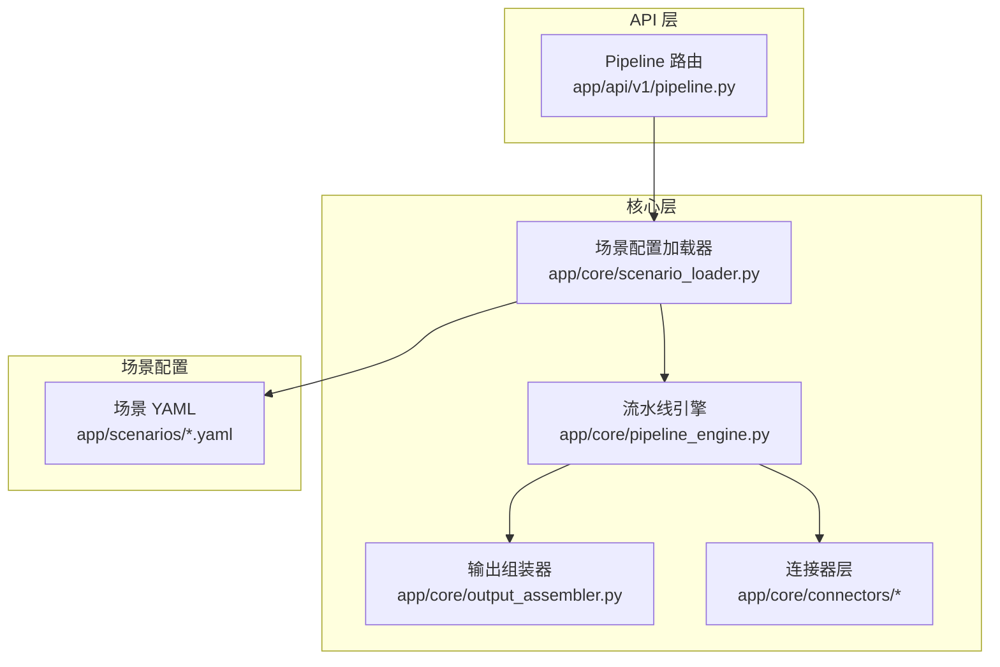
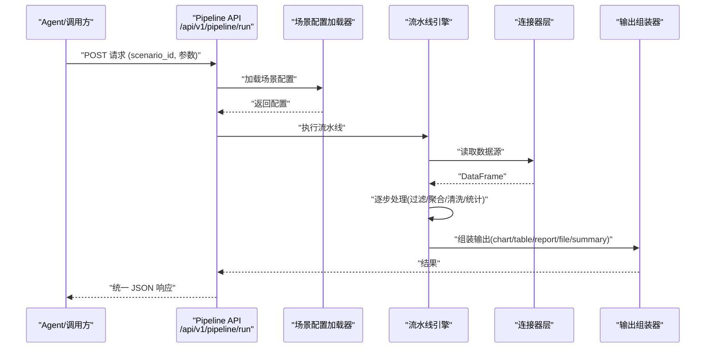

# 项目概述

<cite>
**本文引用的文件**
- [hiagent_辅助_Web_服务需求说明_task-242.md](file://docs\hiagent_辅助_Web_服务需求说明_task-242.md)
</cite>

## 目录
1. [简介](#简介)
2. [项目结构](#项目结构)
3. [核心组件](#核心组件)
4. [架构总览](#架构总览)
5. [详细组件分析](#详细组件分析)
6. [依赖与集成分析](#依赖与集成分析)
7. [性能与可观测性](#性能与可观测性)
8. [故障排查指南](#故障排查指南)
9. [结论](#结论)
10. [附录](#附录)

## 简介
本项目 hiagent 辅助 Web 服务是一个面向多种业务分析场景的 AI Agent 应用，旨在通过“配置驱动 + 流水线模式”的方式，统一支撑竞品分析、机构行为分析、产品规模增量分析等典型场景。其核心价值在于：
- 以 YAML 配置描述数据源、处理步骤与输出，实现“场景即配置”，降低新增场景的开发成本
- 提供 Pipeline 引擎与原子 API 双模式：既支持一键式全流程执行，也支持细粒度编排
- 通过连接器层屏蔽多源数据接入差异，统一返回 DataFrame，便于后续处理与可视化
- 强调无状态、单一职责、输入输出标准化、容错优先与安全隔离，确保可扩展性与稳定性

该服务适用于需要快速落地数据分析与报告生成的业务团队，能够显著减少重复开发，提升交付效率。

**章节来源**
- [hiagent_辅助_Web_服务需求说明_task-242.md:5-15](file://docs\hiagent_辅助_Web_服务需求说明_task-242.md#L5-L15)

## 项目结构
根据需求文档，项目采用分层与模块化组织方式，关键目录与职责如下：
- app/core/pipeline_engine.py：Pipeline 引擎，负责按配置顺序执行步骤、传递上下文、记录日志与耗时
- app/core/scenario_loader.py：场景配置加载器，从 YAML 加载并校验场景定义
- app/core/connectors/：连接器层（base/database/api/file），统一数据接入接口，注册表模式扩展
- app/core/output_assembler.py：输出组装器，将中间结果渲染为 chart/table/report/file/summary
- app/scenarios/*.yaml：场景配置文件，描述 data_sources、pipeline、outputs
- app/api/v1/pipeline.py：Pipeline 路由，暴露 /api/v1/pipeline/run 等接口

**图表来源**
- [hiagent_辅助_Web_服务需求说明_task-242.md:106-115](file://docs\hiagent_辅助_Web_服务需求说明_task-242.md#L106-L115)

**章节来源**
- [hiagent_辅助_Web_服务需求说明_task-242.md:106-115](file://docs\hiagent_辅助_Web_服务需求说明_task-242.md#L106-L115)

## 核心组件
- 场景配置模型（YAML）：集中描述数据源、处理步骤与输出，支持注释与可读性维护
- 连接器层（Connector Layer）：数据库直连、REST API、文件上传/下载、对象存储等，统一返回 DataFrame
- 流水线引擎（Pipeline Engine）：顺序执行步骤，命名引用传递中间数据，支持条件分支与步骤级错误处理
- 输出组装器（Output Assembler）：生成图表、表格、报告、文件与摘要，适配不同消费端
- 统一接口规范：JSON 响应格式、错误码分段、API Key 认证，保障一致性与安全性

**章节来源**
- [hiagent_辅助_Web_服务需求说明_task-242.md:25-68](file://docs\hiagent_辅助_Web_服务需求说明_task-242.md#L25-L68)

## 架构总览
系统整体流程：Agent 请求进入 Pipeline API 入口后，由场景配置加载器读取对应 YAML，构建数据获取层（Connector）、数据处理流水线（Step 链）与输出组装器，最终返回统一格式的响应。

**图表来源**
- [hiagent_辅助_Web_服务需求说明_task-242.md:33-68](file://docs\hiagent_辅助_Web_服务需求说明_task-242.md#L33-L68)

## 详细组件分析

### 场景配置模型（YAML）
- data_sources：定义 connector 类型、连接配置、SQL/API 参数与请求参数映射
- pipeline：定义步骤链，每个步骤调用原子能力，并通过命名引用传递中间数据
- outputs：定义输出类型（chart/table/report/file/summary）及数据来源引用

设计要点：
- 场景可配置：新增场景仅需新增 YAML 与必要连接器/步骤
- 组件可复用：步骤与连接器可跨场景复用
- 安全隔离：凭据从环境变量读取，不硬编码

**章节来源**
- [hiagent_辅助_Web_服务需求说明_task-242.md:40-64](file://docs\hiagent_辅助_Web_服务需求说明_task-242.md#L40-L64)

### 连接器层（Connector Layer）
- 类型覆盖：database、api、file_upload、file_url、file_s3（后期扩展）
- 统一返回：所有连接器返回 DataFrame，便于下游处理
- 扩展方式：注册表模式，新增连接器改动最小

适用场景：
- 数据库直连：MySQL/PostgreSQL/ClickHouse
- 外部 API：REST 调用，支持鉴权模板与重试
- 文件接入：上传或 URL 下载，自动编码检测与类型推断

**章节来源**
- [hiagent_辅助_Web_服务需求说明_task-242.md:46-55](file://docs\hiagent_辅助_Web_服务需求说明_task-242.md#L46-L55)

### 流水线引擎（Pipeline Engine）
- 执行模型：顺序执行步骤，通过 PipelineContext 命名引用传递中间数据
- 控制流：支持条件分支、步骤级错误处理（skip/abort）
- 可观测性：每步独立记录日志与耗时，便于定位瓶颈

优化点：
- 步骤级缓存：对相同输入的步骤结果进行缓存
- 并行化：对无依赖步骤进行并发执行（需评估资源占用）

**章节来源**
- [hiagent_辅助_Web_服务需求说明_task-242.md:57-61](file://docs\hiagent_辅助_Web_服务需求说明_task-242.md#L57-L61)

### 输出组装器（Output Assembler）
- 输出类型：chart、table、report、file、summary
- 渲染能力：图表（PNG/SVG/HTML）、报告（Jinja2 HTML、Markdown→HTML）、表格（条件着色、排序）
- 适配消费端：Agent 可直接消费 summary，其他系统可消费 file/chart/table

**章节来源**
- [hiagent_辅助_Web_服务需求说明_task-242.md:62-64](file://docs\hiagent_辅助_Web_服务需求说明_task-242.md#L62-L64)

### 两种调用模式
- 模式 A：Pipeline API（/api/v1/pipeline/run）— 传入 scenario_id 与参数，一次完成全流程
- 模式 B：原子 API（/api/v1/data/*、/api/v1/visual/* 等）— 逐步调用，Agent 自行编排

价值：
- 降低 Agent 编排复杂度，同时保留灵活性
- 便于分阶段上线与灰度验证

**章节来源**
- [hiagent_辅助_Web_服务需求说明_task-242.md:65-68](file://docs\hiagent_辅助_Web_服务需求说明_task-242.md#L65-L68)

## 依赖与集成分析
技术栈与选型理由：
- FastAPI：高性能异步 Web 框架，适合高并发 API
- pandas/numpy：数据处理与分析基础库
- DuckDB：DataFrame SQL 查询，性能优于传统方案
- matplotlib/plotly：图表生成与交互展示
- WeasyPrint：PDF 渲染
- httpx：HTTP 客户端，用于 API 代理与外部调用
- Pydantic：数据校验与序列化
- PyYAML：场景配置解析
- SQLAlchemy：数据库 ORM（可选）
- jsonpath-ng：JSON 路径提取
- Docker/uvicorn：容器化部署与 ASGI 服务器

集成方式：
- 与 Dify/Coze 等平台对接：通过统一 API 与场景配置驱动
- 与外部系统：通过连接器层与 API 编排模块进行 HTTP 代理与数据转换
- 文件与文档：支持 CSV/Excel/JSON/Markdown/HTML/PDF/Word/Excel/PPT 等格式互转与模板渲染

**章节来源**
- [hiagent_辅助_Web_服务需求说明_task-242.md:19-21](file://docs\hiagent_辅助_Web_服务需求说明_task-242.md#L19-L21)
- [hiagent_辅助_Web_服务需求说明_task-242.md:73-94](file://docs\hiagent_辅助_Web_服务需求说明_task-242.md#L73-L94)

## 性能与可观测性
- 性能目标：简单接口 < 500ms，数据处理 < 3s，Pipeline 全流程 < 10s
- 可观测性：结构化日志包含 scenario_id 与步骤耗时；提供 /health 健康检查与 /api/v1/pipeline/scenarios 场景列表接口
- 部署：Docker 容器化，环境变量配置，场景配置热加载

建议：
- 针对大数据量场景启用分页与流式处理
- 对热点步骤引入缓存与索引优化
- 监控 CPU/内存/GC 指标，结合链路追踪定位瓶颈

**章节来源**
- [hiagent_辅助_Web_服务需求说明_task-242.md:97-102](file://docs\hiagent_辅助_Web_服务需求说明_task-242.md#L97-L102)

## 故障排查指南
常见问题与处理思路：
- 数据源连接失败：检查环境变量凭据、网络连通性与权限
- SQL 注入风险：使用参数化查询与白名单校验
- 文件沙箱越界：限制访问路径与 MIME 类型
- 步骤执行异常：查看步骤级日志与耗时，必要时启用 skip/abort 策略
- 输出渲染失败：检查模板变量与数据类型，确认依赖库版本兼容

最佳实践：
- 在 YAML 中明确定义输入输出 schema，使用 Pydantic 校验
- 对关键步骤增加断言与回滚机制
- 对外部 API 调用设置超时与重试策略

**章节来源**
- [hiagent_辅助_Web_服务需求说明_task-242.md:97-102](file://docs\hiagent_辅助_Web_服务需求说明_task-242.md#L97-L102)

## 结论
hiagent 辅助 Web 服务通过“配置驱动 + 流水线模式”的统一架构，有效降低了多业务场景的分析与报告生成成本。其核心优势包括：
- 场景可配置、组件可复用，快速扩展新场景
- 连接器层屏蔽多源数据差异，统一处理与可视化
- 双模式调用兼顾易用性与灵活性
- 强调无状态、单一职责、标准化与安全隔离

对于初学者而言，可从“场景 YAML + 原子 API”入手，逐步理解 Pipeline 引擎与连接器层的协作方式，再深入到性能优化与可观测性建设。

## 附录
- 开发路线图：Phase 1 基础框架与原子能力 → Phase 2 Pipeline 引擎与连接器 → Phase 3 文档与报告 → Phase 4 完善与扩展
- 关键决策：Pipeline+原子 API 双模式、YAML 配置、DuckDB 作为 SQL 引擎、注册表模式连接器、本地临时文件存储（后期可扩展 OSS）

**章节来源**
- [hiagent_辅助_Web_服务需求说明_task-242.md:118-142](file://docs\hiagent_辅助_Web_服务需求说明_task-242.md#L118-L142)