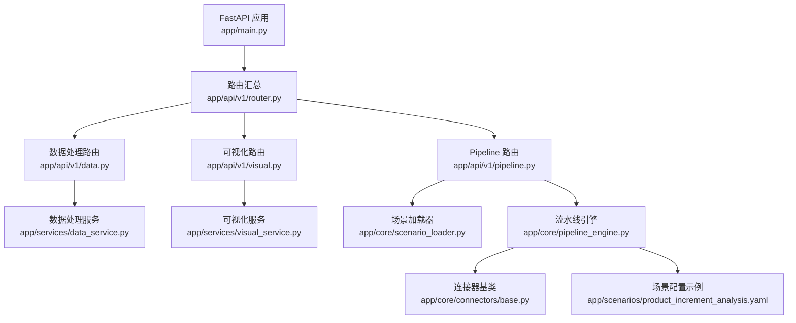
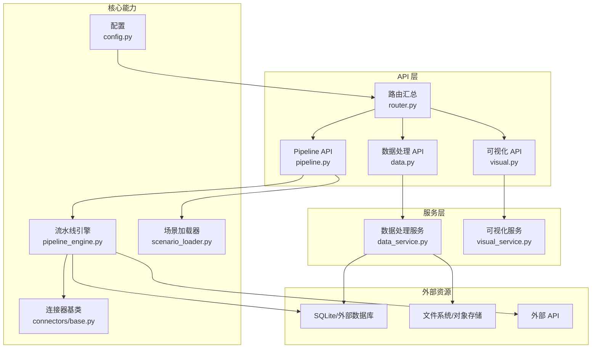
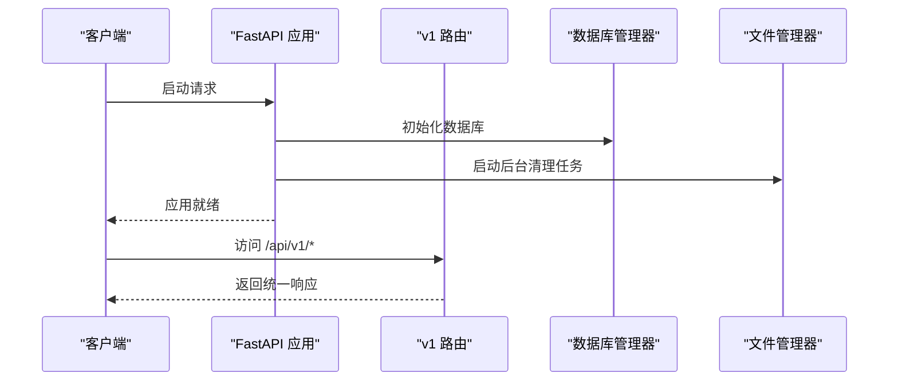
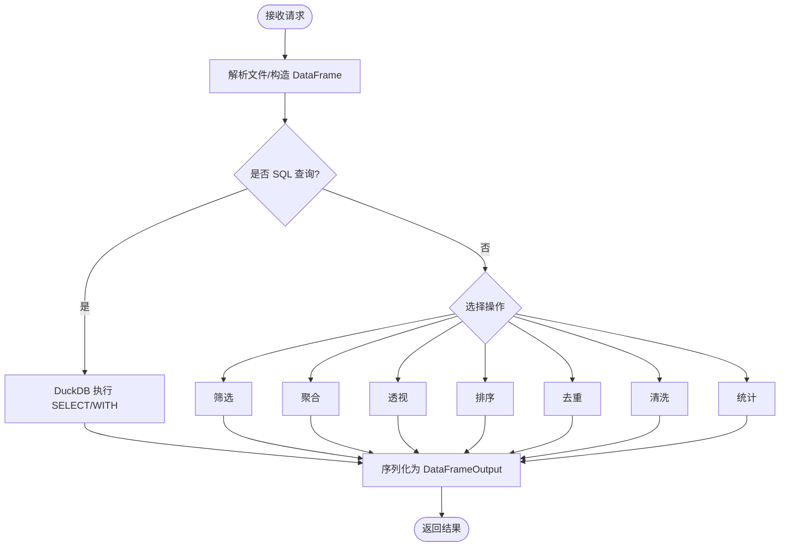
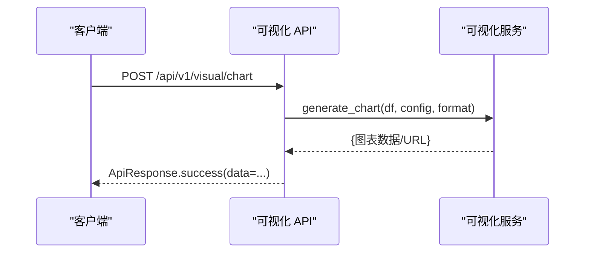
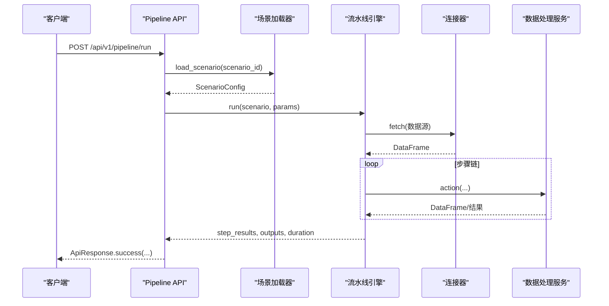
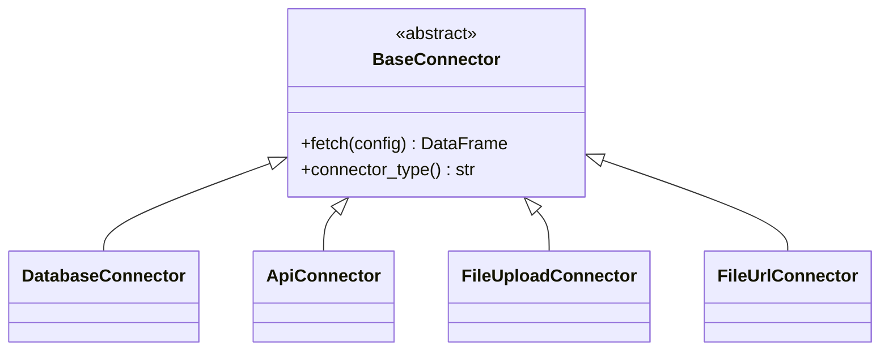
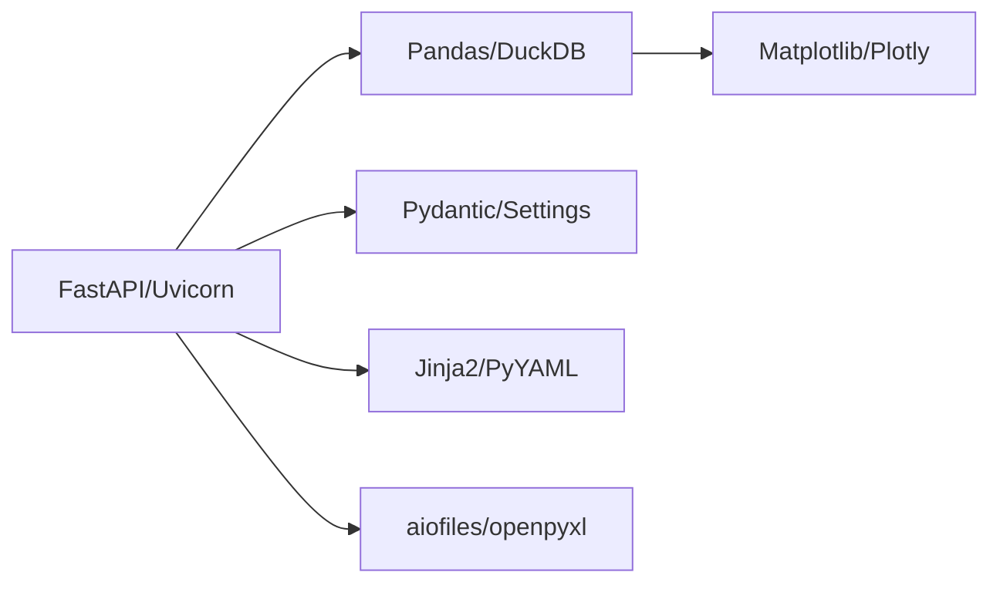

# 项目概述

<cite>
**本文引用的文件**
- [app/main.py](file://app/main.py)
- [app/config.py](file://app/config.py)
- [requirements.txt](file://requirements.txt)
- [Dockerfile](file://Dockerfile)
- [app/api/v1/router.py](file://app/api/v1/router.py)
- [app/api/v1/data.py](file://app/api/v1/data.py)
- [app/api/v1/visual.py](file://app/api/v1/visual.py)
- [app/api/v1/pipeline.py](file://app/api/v1/pipeline.py)
- [app/services/data_service.py](file://app/services/data_service.py)
- [app/models/data_models.py](file://app/models/data_models.py)
- [app/core/pipeline_engine.py](file://app/core/pipeline_engine.py)
- [app/core/scenario_loader.py](file://app/core/scenario_loader.py)
- [app/core/connectors/base.py](file://app/core/connectors/base.py)
- [app/scenarios/product_increment_analysis.yaml](file://app/scenarios/product_increment_analysis.yaml)
- [docs/20260821100000_hiagent辅助Web服务_需求说明.md](file://docs/20260821100000_hiagent辅助Web服务_需求说明.md)
</cite>

## 目录
1. [简介](#简介)
2. [项目结构](#项目结构)
3. [核心组件](#核心组件)
4. [架构总览](#架构总览)
5. [详细组件分析](#详细组件分析)
6. [依赖关系分析](#依赖关系分析)
7. [性能与扩展性](#性能与扩展性)
8. [故障排查指南](#故障排查指南)
9. [结论](#结论)
10. [附录](#附录)

## 简介
hiagent 辅助 Web 服务是一个面向 AI Agent 的通用数据处理、可视化与文件生成能力平台。它通过“场景配置 + 流水线引擎”的方式，将多源数据接入、清洗转换、统计分析、图表渲染与报告输出串联为可编排的工作流；同时暴露原子 API，供 Agent 灵活组合调用。

- 核心目标：以无状态、单一职责、输入输出标准化为原则，提供高内聚的数据处理与可视化能力，支撑竞品分析、机构行为分析、产品规模增量分析等多样业务场景。
- 主要特性：
  - 统一 JSON 响应格式与错误码规范
  - 基于 YAML 的场景驱动流水线（数据源 -> 步骤链 -> 输出）
  - 连接器抽象（数据库、API、文件上传/下载等）
  - 数据处理（解析、SQL 查询、筛选、聚合、透视、排序、去重、清洗、统计）
  - 可视化（多种图表、HTML 表格、报告模板）
  - 文件与文档操作（格式转换、PDF/Word/Excel 生成、临时文件管理）
  - 双模式调用：Pipeline 一键执行 / 原子 API 逐步编排
- 技术栈优势：
  - FastAPI：高性能异步 Web 框架，天然支持 Pydantic 校验与 OpenAPI 文档
  - Pandas + DuckDB：高效 DataFrame 计算与内存 SQL 查询
  - Matplotlib/Plotly/Kaleido：丰富的图表渲染与导出能力
  - PyYAML + Jinja2：场景配置可读性与报告模板化
  - Docker + Uvicorn：容器化部署与快速启动

**章节来源**
- [docs/20260821100000_hiagent辅助Web服务_需求说明.md:19-102](file://docs/20260821100000_hiagent辅助Web服务_需求说明.md#L19-L102)
- [requirements.txt:1-31](file://requirements.txt#L1-L31)

## 项目结构
项目采用分层与模块化组织：
- 入口与配置：应用生命周期、中间件、异常处理、配置加载
- API 层：按功能划分路由（数据、可视化、Pipeline、报表、健康检查）
- 服务层：封装业务逻辑（数据处理、可视化、报表）
- 模型层：Pydantic 请求/响应模型，保证接口契约
- 核心能力：流水线引擎、场景配置加载器、连接器抽象、文件管理、数据库连接
- 场景配置：YAML 描述数据源、步骤链与输出定义
- 测试与脚本：单元测试、数据导入脚本

**图示来源**
- [app/main.py:29-98](file://app/main.py#L29-L98)
- [app/api/v1/router.py:1-18](file://app/api/v1/router.py#L1-L18)
- [app/api/v1/data.py:1-201](file://app/api/v1/data.py#L1-L201)
- [app/api/v1/visual.py:1-30](file://app/api/v1/visual.py#L1-L30)
- [app/api/v1/pipeline.py:1-48](file://app/api/v1/pipeline.py#L1-L48)
- [app/core/scenario_loader.py:1-128](file://app/core/scenario_loader.py#L1-L128)
- [app/core/pipeline_engine.py:1-357](file://app/core/pipeline_engine.py#L1-L357)
- [app/core/connectors/base.py:1-24](file://app/core/connectors/base.py#L1-L24)
- [app/scenarios/product_increment_analysis.yaml:1-126](file://app/scenarios/product_increment_analysis.yaml#L1-L126)

**章节来源**
- [app/main.py:29-98](file://app/main.py#L29-L98)
- [app/api/v1/router.py:1-18](file://app/api/v1/router.py#L1-L18)
- [app/config.py:1-23](file://app/config.py#L1-L23)
- [Dockerfile:1-24](file://Dockerfile#L1-L24)

## 核心组件
- 应用入口与生命周期
  - 创建 FastAPI 应用、注册中间件（CORS、request_id）、异常处理器、路由挂载、文件下载端点
  - 启动时初始化 SQLite 数据集库并启动后台临时文件清理任务
- 配置管理
  - 从环境变量或 .env 读取应用名、端口、日志级别、存储路径、场景目录、数据库路径等
- 数据处理服务
  - 文件解析（CSV/Excel/JSON，自动编码检测）
  - SQL 查询（DuckDB，仅允许 SELECT/WITH，注入防护）
  - 筛选、聚合、透视、排序、去重、清洗、统计分析
  - 统一的 DataFrameInput/DataFrameOutput 序列化
- 可视化服务
  - 图表生成（柱状图/折线图/饼图等，支持 PNG/SVG/HTML）
  - HTML 表格渲染（条件着色、排序）
- Pipeline 引擎
  - 场景驱动：加载 YAML 配置，构建上下文，顺序执行步骤链
  - 参数映射：支持 $input.xxx 引用替换
  - 条件分支与错误处理：支持 skip/abort 策略
  - 输出组装：chart/table/file/summary 等多类型输出
- 场景配置加载器
  - 从 app/scenarios/*.yaml 加载场景，校验并转换为 Pydantic 模型
  - 提供列出可用场景的能力
- 连接器抽象
  - BaseConnector 定义 fetch 接口，便于扩展 database/api/file_upload/file_url 等数据源

**章节来源**
- [app/main.py:29-98](file://app/main.py#L29-L98)
- [app/config.py:1-23](file://app/config.py#L1-L23)
- [app/services/data_service.py:35-447](file://app/services/data_service.py#L35-L447)
- [app/models/data_models.py:1-145](file://app/models/data_models.py#L1-L145)
- [app/core/pipeline_engine.py:37-357](file://app/core/pipeline_engine.py#L37-L357)
- [app/core/scenario_loader.py:19-128](file://app/core/scenario_loader.py#L19-L128)
- [app/core/connectors/base.py:1-24](file://app/core/connectors/base.py#L1-L24)

## 架构总览
系统采用“API 层 — 服务层 — 核心能力层”的分层设计，结合“场景配置驱动的流水线”实现解耦与可扩展。

**图示来源**
- [app/api/v1/router.py:1-18](file://app/api/v1/router.py#L1-L18)
- [app/api/v1/data.py:1-201](file://app/api/v1/data.py#L1-L201)
- [app/api/v1/visual.py:1-30](file://app/api/v1/visual.py#L1-L30)
- [app/api/v1/pipeline.py:1-48](file://app/api/v1/pipeline.py#L1-L48)
- [app/services/data_service.py:1-447](file://app/services/data_service.py#L1-L447)
- [app/core/pipeline_engine.py:1-357](file://app/core/pipeline_engine.py#L1-L357)
- [app/core/scenario_loader.py:1-128](file://app/core/scenario_loader.py#L1-L128)
- [app/core/connectors/base.py:1-24](file://app/core/connectors/base.py#L1-L24)
- [app/config.py:1-23](file://app/config.py#L1-L23)

## 详细组件分析

### 应用入口与生命周期
- 创建 FastAPI 应用，设置标题、描述、版本
- 注册 CORS 中间件与 request_id 注入中间件
- 注册全局异常处理器（应用异常、验证异常、通用异常）
- 挂载 v1 路由与文件下载端点
- 生命周期：启动时初始化数据库、启动后台清理任务；关闭时取消任务

**图示来源**
- [app/main.py:29-98](file://app/main.py#L29-L98)

**章节来源**
- [app/main.py:29-98](file://app/main.py#L29-L98)

### 数据处理模块
- 文件解析：支持 CSV/Excel/JSON，自动编码检测，空内容校验
- SQL 查询：使用 DuckDB 内存数据库执行 SELECT/WITH，严格白名单校验防止注入
- 数据操作：筛选（多运算符与 and/or 组合）、聚合（groupby + 多函数）、透视表、排序、去重
- 数据清洗：填充空值、删除空值、类型转换、文本清洗、异常值过滤
- 统计分析：描述性统计、相关性矩阵、频率分布
- 统一输出：DataFrameMeta 包含行列数、列名与类型信息

**图示来源**
- [app/services/data_service.py:77-447](file://app/services/data_service.py#L77-L447)
- [app/models/data_models.py:13-145](file://app/models/data_models.py#L13-L145)

**章节来源**
- [app/services/data_service.py:77-447](file://app/services/data_service.py#L77-L447)
- [app/models/data_models.py:13-145](file://app/models/data_models.py#L13-L145)
- [app/api/v1/data.py:39-201](file://app/api/v1/data.py#L39-L201)

### 可视化模块
- 图表生成：支持多种图表类型与输出格式（PNG/SVG/HTML）
- 表格渲染：HTML 表格，支持条件着色与排序
- 输入：DataFrameInput + ChartConfig/TableConfig
- 输出：统一 ApiResponse.data

**图示来源**
- [app/api/v1/visual.py:13-29](file://app/api/v1/visual.py#L13-L29)

**章节来源**
- [app/api/v1/visual.py:1-30](file://app/api/v1/visual.py#L1-L30)

### Pipeline 引擎与场景配置
- 场景加载：从 YAML 加载场景配置，校验字段并转换为 Pydantic 模型
- 上下文管理：PipelineContext 维护中间 DataFrame 与非 DataFrame 结果
- 参数映射：$input.xxx 动态替换，支持嵌套字典
- 条件评估：has/not_empty 简单表达式
- Action 路由：query/filter/aggregate/pivot/sort/dedup/clean/statistics
- 错误处理：每步记录耗时与状态，支持 skip/abort
- 输出组装：根据 outputs 定义生成 chart/table/file/summary

**图示来源**
- [app/api/v1/pipeline.py:14-48](file://app/api/v1/pipeline.py#L14-L48)
- [app/core/scenario_loader.py:68-128](file://app/core/scenario_loader.py#L68-L128)
- [app/core/pipeline_engine.py:249-357](file://app/core/pipeline_engine.py#L249-L357)
- [app/core/connectors/base.py:11-24](file://app/core/connectors/base.py#L11-L24)

**章节来源**
- [app/core/scenario_loader.py:19-128](file://app/core/scenario_loader.py#L19-L128)
- [app/core/pipeline_engine.py:37-357](file://app/core/pipeline_engine.py#L37-L357)
- [app/scenarios/product_increment_analysis.yaml:1-126](file://app/scenarios/product_increment_analysis.yaml#L1-L126)

### 连接器抽象
- BaseConnector 定义 fetch 与 connector_type 接口
- 扩展新数据源只需实现上述两个方法，并通过注册表模式被引擎发现

**图示来源**
- [app/core/connectors/base.py:11-24](file://app/core/connectors/base.py#L11-L24)

**章节来源**
- [app/core/connectors/base.py:1-24](file://app/core/connectors/base.py#L1-L24)

## 依赖关系分析
- 运行时依赖
  - Web 框架：FastAPI、Uvicorn、python-multipart、Pydantic、pydantic-settings、python-dotenv
  - 数据处理：Pandas、NumPy、DuckDB、chardet
  - 可视化：Matplotlib、Plotly、Kaleido
  - 文件与模板：aiofiles、openpyxl、Jinja2、PyYAML、SQLAlchemy
  - 测试：pytest、pytest-asyncio、httpx
- 容器化
  - 基础镜像 python:3.10-slim，安装系统依赖，复制 requirements 并安装，暴露 8080 端口，默认命令运行 uvicorn

**图示来源**
- [requirements.txt:1-31](file://requirements.txt#L1-L31)
- [Dockerfile:1-24](file://Dockerfile#L1-L24)

**章节来源**
- [requirements.txt:1-31](file://requirements.txt#L1-L31)
- [Dockerfile:1-24](file://Dockerfile#L1-L24)

## 性能与扩展性
- 性能特征
  - 简单接口 < 500ms，数据处理 < 3s，Pipeline 全流程 < 10s（参考需求文档）
  - DuckDB 内存 SQL 查询提升大数据集处理效率
  - 异步中间件与异步生命周期管理减少阻塞
- 扩展性考虑
  - 连接器注册表模式：新增数据源仅需实现 BaseConnector
  - 场景配置驱动：新增业务场景无需改动代码，仅添加 YAML
  - 原子 API 与 Pipeline 双模式：兼顾灵活性与易用性
  - 统一响应与错误码：便于前端与 Agent 集成
- 优化建议
  - 对大文件解析启用分块读取与类型推断缓存
  - 对频繁查询的 DataFrame 建立索引或使用持久化缓存
  - 对图表渲染进行异步队列化处理，避免阻塞请求线程

[本节为通用指导，不直接分析具体文件]

## 故障排查指南
- 常见错误与定位
  - 场景配置不存在或 YAML 解析失败：检查 scenarios_dir 与 YAML 格式
  - SQL 安全限制：仅允许 SELECT/WITH，避免危险关键字
  - 数据为空或类型不匹配：检查 DataFrameInput 结构与 dtypes 提示
  - 连接器未实现或类型错误：确认 connector_type 与 fetch 实现
- 调试手段
  - 查看应用日志中的步骤耗时与状态（step_results）
  - 使用 /health 与健康检查确认服务状态
  - 通过 /api/v1/pipeline/scenarios 列出可用场景，核对 scenario_id

**章节来源**
- [app/core/scenario_loader.py:68-128](file://app/core/scenario_loader.py#L68-L128)
- [app/services/data_service.py:128-158](file://app/services/data_service.py#L128-L158)
- [app/core/pipeline_engine.py:274-357](file://app/core/pipeline_engine.py#L274-L357)

## 结论
hiagent 辅助 Web 服务以 FastAPI 为核心，结合 Pandas、DuckDB、Matplotlib/Plotly 等技术栈，构建了“场景配置 + 流水线引擎”的现代化数据处理与可视化平台。其分层设计与模块化结构确保了高内聚、低耦合与强扩展性，既能满足 Agent 的复杂编排需求，也能通过原子 API 提供灵活的二次开发能力。通过容器化部署与统一接口规范，项目具备良好的可观测性、可维护性与可移植性。

[本节为总结性内容，不直接分析具体文件]

## 附录
- 关键目录与职责
  - app/api/v1：REST 路由（数据、可视化、Pipeline、报表、健康检查）
  - app/services：业务逻辑封装（数据处理、可视化、报表）
  - app/models：Pydantic 模型（请求/响应契约）
  - app/core：核心能力（流水线引擎、场景加载器、连接器、文件管理、数据库）
  - app/scenarios：场景 YAML 配置
  - tests：单元测试
  - scripts：数据导入脚本
- 启动方式
  - 本地：uvicorn 运行 app.main:app
  - 容器：Docker 镜像暴露 8080 端口

**章节来源**
- [app/api/v1/router.py:1-18](file://app/api/v1/router.py#L1-L18)
- [Dockerfile:1-24](file://Dockerfile#L1-L24)
- [app/main.py:101-109](file://app/main.py#L101-L109)